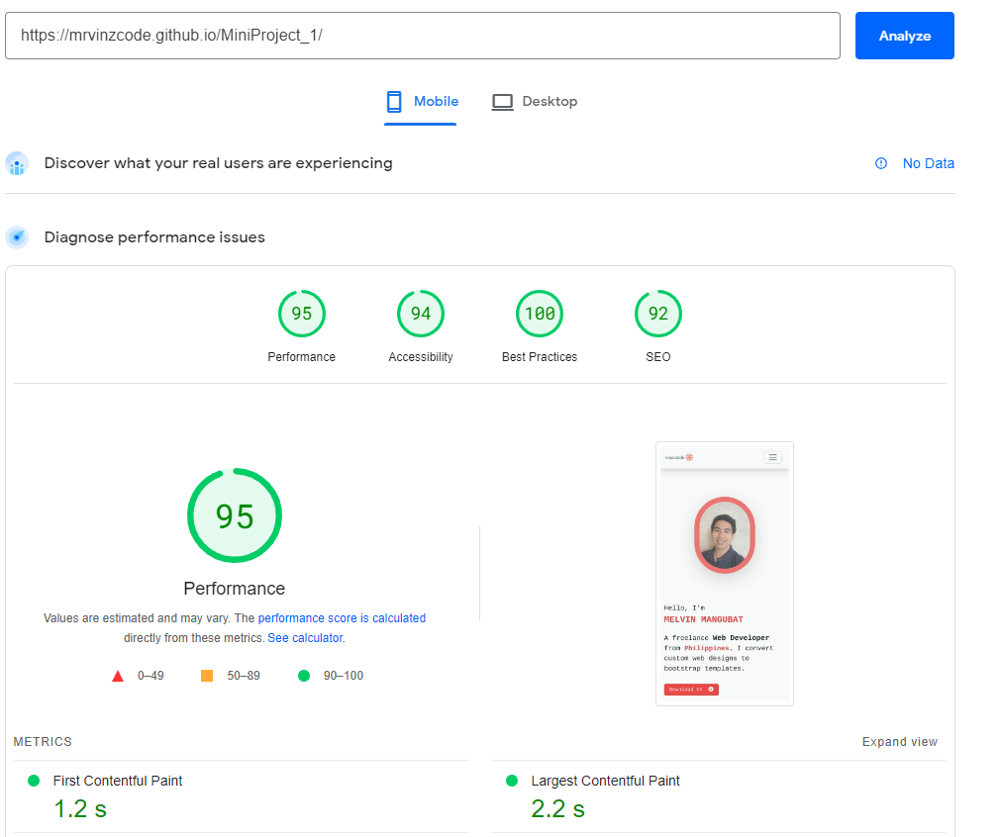
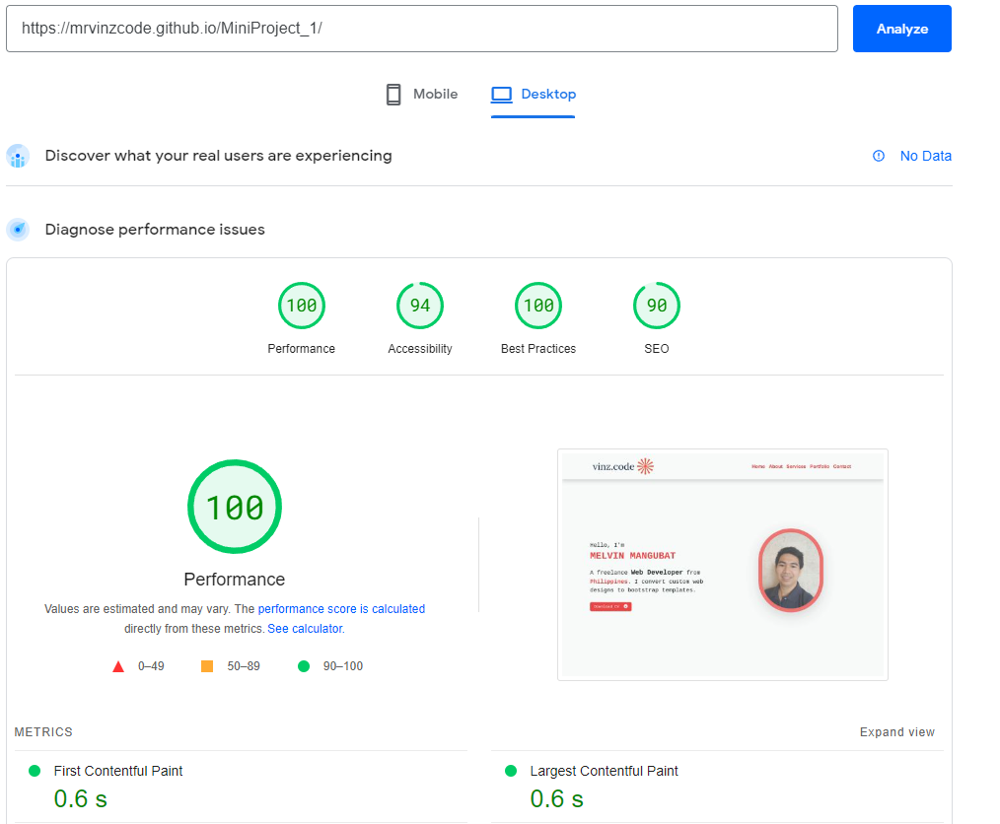
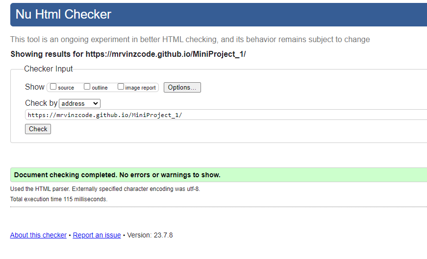

# MiniProject_01

## Simple Portfolio Site demonstrates my projects in the boot camp

## Github Page Live Link: https://mrvinzcode.github.io/MiniProject_1/

## Github Repository Link: https://github.com/mrVinzcode/MiniProject_1

## Screenshot page speed according to that site.

## Screenshot of W3.org Validator

## Technologies and Version

1. HTML
2. CSS
3. Bootstrap v5.2
4. Git

## Current Features Implemented 

1. Responsive design with the help of Bootstrap.
2. 
3. Bootstrap buttons for toggling navigation

